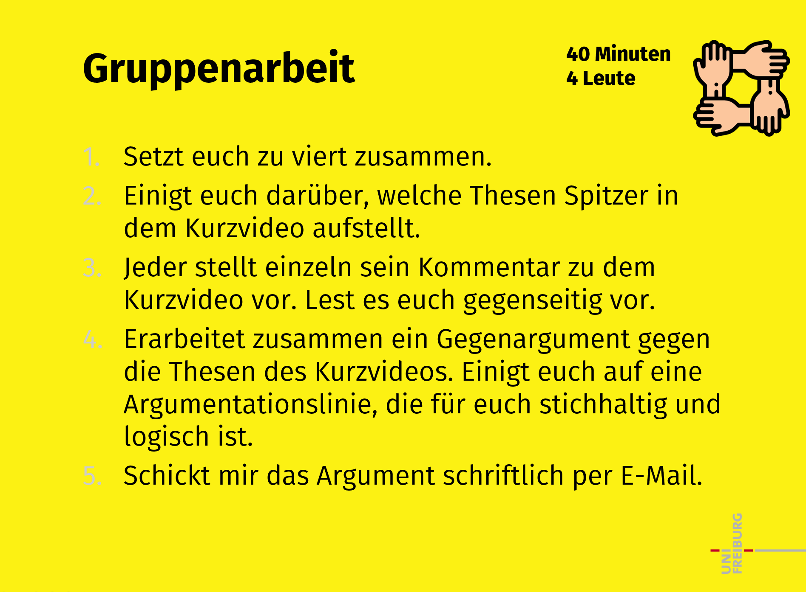

Hauptthese von Spitzer: Google ist schlecht zum Lernen bzw. „bei Google bleibt nichts hängen“ Unser Gegenargument dazu: Google ist eine Suchmaschine und keine Lernumgebung. Die Intention ist nicht hauptsächlich das Lernen, zumindest vorerst, sondern Informationen zu beschaffen. Das heißt Google ist ein Zwischenschritt auf dem Weg zum eigentlichen Lernen. Die Vergleichbarkeit mit direkten Lernmedien ist daher schwierig. Unserer Meinung nach ist das Lernen nicht primär vom Medium abhängig, sondern von den Strategien die angewendet werden.

Spitzer sagt, dass beim Einsatz von digitalen Medien nur „gedaddelt” werde, wodurch ohne zu Lernen herumgeklickt werde. Google sei im Vergleich zu Büchern, Zeitschriften, etc. die schlechteste Methode, etwas zu lernen. Unsere Argumentation dagegen ist, dass nach Sparrow das Internet als externer Erinnerungsspeicher fungiert. Wir lernen, wie und wo zu recherchieren ist, wodurch wir auf breitere Informationen zugreifen können. Somit ist das Lernen mit digitalen Medien effektiver, wenn es richtig verwendet wird. Es kommt auf die Ausgestaltung der Lernumgebung an, inwieweit das eigene Lernen gesteuert wird. Dass die kategorische Ablehnung von Forderungen nach printmedienbasierten Lernszenarien von Spitzer nicht in aller Gänze beizupflichten ist, machen die Untersuchungen von Sparrow et al. (2011) deutlich. Sofern Lernern und Lernerinnen der Bedeutung von Inhalten bewusst ist und die Gewissheit, dass jene Informationen im Prüfungsszenario nicht mehr zum Nachschlagen zur Verfügung stehen gegeben ist, sind auch bildschirmbasierte Medien geeignet.
Dennoch nicht zu vernachlässigen ist die eigene Motivation konzentriert zu arbeiten. Nach Sparrow et al lernen wir nicht weniger, sondern andere Dinge. Doch Sparrow beschreibt nur das Lernen über deklaratives Wissen. Spannend wäre zu betrachten, wie prozedurales Wissen von digitalen Medien beeinflusst wird.
Spitzer möchte Medien zur nachhaltigen Weiterbildung am liebsten verbannen. Wenn dies geschehe, würde das Lernen, mit den digitalen Medien umzugehen, nicht stattfinden, was zielloses „gedaddle” befeuern würde.

Gegen die These, das Googlen prinzipiell schlecht fürs Lernen ist spricht der individuelle Umgang mit dem Medium (Google). Google bietet als Suchmaschine eine Vielfalt an Möglichkeiten auf Informationen zuzugreifen, sie zu vergleichen und zu verknüpfen. Zwar bestehen beim Googlen mehr Gefahren der Ablenkung, dennoch ist es wichtig wie sehr man selbst den Fokus auf den Lerninhalt/ die Textinformation legt. Außerdem spricht gegen die These, dass sowohl die Wichtigkeit der Information und die Notwendigkeit diese auch zu behalten eine entscheidende Rolle bei der Informationsbeschaffung zum Lernen spielen.

Thesen von Spitzer
1.	Google ist das ungeeignetste Lernmedium. 
2.	Handschriftlich merkt man sich mehr, als mit dem Computer.
3.	Lesen von gedruckten Texten ist besser, als von Online-Texten. 
4.	Das Fehlen von Literaturangeben und das Verlinken von Daten führt zum Datteln.

Gegenargument

1.	Suchmaschinen z. B. Google sind keine Lernmedien. Sie sind Bibliotheken und welche Inhalte man sich daraus tatsächlich herauszieht, hängt von jedem selbst ab. 
Das Gehirn und seine Denkstrukturen passen sich auf neue Computer- und Technologie an. 
2.	Gedruckte Enzyklopädien sind ebenfalls externe Speicherungen und existierten vor den Suchmaschinen. 
3.	Es ist kein zwangsläufiger Nachteil, dass das Wissen extern gespeichert wird. 

„Googlen ist zum Lernen das ungeeignetste Medium“, behauptet der Universitätsprofessor Manfred Spitzer in seinem Vortrag.
Die von ihm genannte Studie (die eigentlich diese Aussage stützen soll) ist jedoch keine geeignete Grundlage für seine Aussage, da es keinen Vergleich zwischen den Lernmedien nachweist, sondern lediglich auf Effekte von digitalen Medien bezieht.
Sparrow, Liu und Wegner (2011) legen zwar da, dass die untersuchten Probanden zwar häufiger nicht mehr wissen, was sie gelernt haben. Allerdings nutzen sie vielmehr ihre Hirnkapazitäten dafür, wo sich die Informationen befinden.   Außerdem können wir in einer kurzen Zeit auf eine Vielzahl von Informationen zurückgreifen (N. Carr, Atlantic, 2008). Dies bedeutet also das sich ein modernes oder „angepassteres“ Gedächtnis entwickelt, das mit Hilfe des Internets produktiv arbeiten kann. Wir sind der Meinung das kritisches Denken auch für Digitale Imigranten wichtig ist.
Es besteht also kein Unterschied ob dein guter Freund Google ….         

Spitzers Thesen
Beim Googlen verschlechtert sich der Lernerfolg grundsätzlich. 
Während des Lernens mit digitalen Medien wird man immer abgelenkt, weshalb die Verarbeitung oberflächlicher stattfindet. 
Mitschreiben ist lernförderlicher als Mittippen. 
Papiertexte werden bevorzugt gelesen und als seriöser wahrgenommen von Schüler*innen.

Gegenargumente
Ablenkung auf digitalen Medien besteht nicht IMMER, sondern KANN möglicherweise auftreten. Spitzer bezieht sich auf elektronische Textbücher, die durch Links lernförderliche Inhalte zur Verfügung stellen, oder Videos beinhalten, die zum besseren Textverständnis beitragen.
Grundsätzlich ist analoges Mitschreiben besser für tiefgehendes Verarbeiten. Bei digitalen Medien neigt man dazu eine Fülle an Informationen zu reproduzieren, um so viel wie möglich zu speichern für den späteren Lernprozess. Lernerfolg hängt allerdings nicht vom Medium des Mitschreibens und der Menge ab, sondern von der späteren Verarbeitung. Außerdem spielen weitere Faktoren wie Motivation und Konzentration eine viel größere Rolle, die nicht durch das Medium beeinflussbar sind.
Googeln umfasst nicht den allgemeinen Umgang mit digitalen Medien, sondern den digitalen Suchprozess. Das hat nichts mit dem Lernerfolg zu tun.
Sparrow et. Al. Kommen in ihren Studien zu dem Schluss, dass man sich an die Möglichkeit des ständigen Zugriffs auf Wissen adaptiert und sich das Gedächtnis dementsprechend von einem deklarativem zu Quellengedächtnis ändert. Wenn der Lernende sich auf dieses Wissen verlässt und das direkte Speichern nicht mehr nötig ist, wird nur der Ort gespeichert an dem man dieses Wissen finden kann. Sobald die Quelle nicht zugänglich ist wird das Wissen direkt verarbeitet. In der Studie fehlen Vergleichsgruppen.

