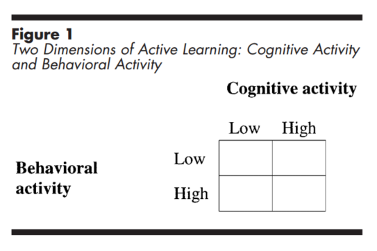

Aktives Lernen findet immer dann statt, wenn sich die Lernenden *geistig* mit dem Lernstoff beschäftigen. Aktives Lernen ist zudem ein Kontinuuum. Man lernt nicht entweder aktiv oder nicht aktiv. Vielmehr kann man aktiver und weniger aktiv lernen. 

Sich geistig mit einem Thema beschäftigen bedeutet nicht, dass man nicht auch körperlich aktiv ist. Körperliche Aktivität ist allerdings für das Prinzip keine notwendige Bedingung. [Mayer (2004, S. 15)](https://psycnet.apa.org/record/2004-10043-002) hat diese Idee einmal in folgender Grafik zusammen gefasst: 

Entscheident für erfolgreiches Lernen ist, dass wir geistig aktiv sind. Diese Idee klingt banal, sie ist aber historisch relativ neu. Mit dem Konstruktivismus (nicht Kognitivismus!) kam man zu der Ansicht, dass Lernen eben nicht nur das Übertragen von Informationen ist, sondern dass jeder Lernende den Lernstoff mit bereits bestehendem Vorwissen verbinden muss, um nachhaltig zu Lernen. Ganz ähnlich wie einem Puzzle müssen neue Teile (neuer Lernstoff) an bestehende Strukturen angedockt werden. Dieses Andocken muss allerdings *aktiv* geschehen, das Lernende selbst in der Verantwortung sind, neues Wissen mit bestehendem Wissen zu verbinden. Lehrkräfte können lediglich Anreize schaffen, dass diese Verbindungen funktionieren. 

> Aktives Lernen findet immer dann statt, wenn Lernende Anstrengung aufwenden, den Lernstoff mit ihrem bestehendem Wissen zu verbinden.

## Gute und schlechte Beispiele

Folgende Szenarien sind *gute* Beispiele für aktives Lernen:

* Das Schreiben einer Zusammenfassung: Die Lernenden denken aktiv über den Zusammenhang mehrerer Konzepte nach. 
* Das aktive Beobachten eines ausgearbeiteten Lösungsbeispiels: Die Lernenden wenden geistige Arbeit auf, ein Konzept oder Prinzip zu verstehen.
* Das Anfertigen einer Concept Map: Die Lernenden denken aktiv über den Zusammenhang mehrere Konzepte nach.
* Das laute Selbsterklärung eines Konzeptes: Die Lernenden wenden geistige Arbeit auf, ein Konzept oder Prinzip zu verstehen.

Folgende Szenarien sind *keine* Beispiele für aktives Lernen: 

* Das passive Zuhören eines Vortrags: Die Lernenden verarbeiten den Lernstoff nur minimal in ihrem Arbeitsgedächtnis. Da das Arbeitsgedächtnis die Pforte zum Langzeitgedächtnis ist, findet kaum Lernen statt.
* Das Lernen eines Konzeptes, welches nicht Teil des Lernstoffs ist. Stell dir vor, du lernst an deinem Laptop und findest eine interessante Doku zufällig auf YouTube. Zwar lernst du etwas, allerdings nicht das, was du lernen sollst. Dieses Problem ist zentral für digitale Lernangebote, da Ablenkungen allgegenwertig sind.
* Trial-und-Error Antwortverhalten bei einer Quizfrage. Nutzer klicken bei einer Frage solange auf die verschiedenen Felder, bis die Antwort richtig ist. Erneut sind Lernende beschäftigt, allerdings nicht auf den Lernstoff ausgerichtet.