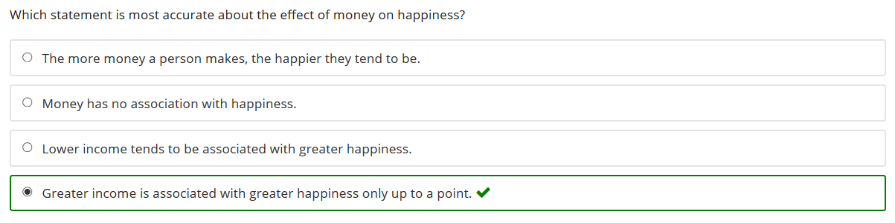

Die folgende Frage stammt aus einem Kurs zum Thema Glück. Nach jedem Modul erhalten die Lernenden mehrere Fragen, aus denen sich die Gesamtpunktzahl des Kurses und damit das Bestehen des Kurses ergibt. 

Die Frage regt aus mehreren Gründen nicht aktives Lernen an:

* Der Distraktor *Lower income tends to be associated with greater happiness* ist zu einfach und kann für die meisten Lernenden einfach ausgeschlossen werden. 
* Die Antwort der Frage wird wortwörtlich bereits in ein paar wenigen Kapitel zuvor besprochen. Um die Frage zu beantworten, muss ein Lernender sich daher lediglich kurz erinnern, was gesagt worden ist.
* Dadurch dass der Kurs nur schwammige Lernziele hat, kann die Frage nicht auf ein konkretes Lernziel ausgerichtet sein und ist daher schlecht mit dem Rest des Kurses verbunden.

Schauen wir uns nochmal unsere Definition von aktivem Lernen an:

> Aktives Lernen findet immer dann statt, wenn Lernende Anstrengung aufwenden, den Lernstoff in ihrem Arbeitsgedächtnis zu verarbeiten und mit ihrem Vorwissen zu verbinden.

Folgende Bedingungen sind bei dieser Frage nicht erfüllt:

* Anstrengung: Nein, da Lernende durch Trial-und-Error die Frage beantworten können und sich daher nicht geistig tief mit dem Lernstoff beschäftigen
* Lernstoff: Nur teils, da nur schwammig in dem Kurs definiert ist, was der Lernstoff ist. Die Lernenden lernen sozusagen in die Leere.
* Vorwissen: Nein, die Lernenden müssen nur rekapitulieren, was sie vor ein paar Minuten gelesen haben.
