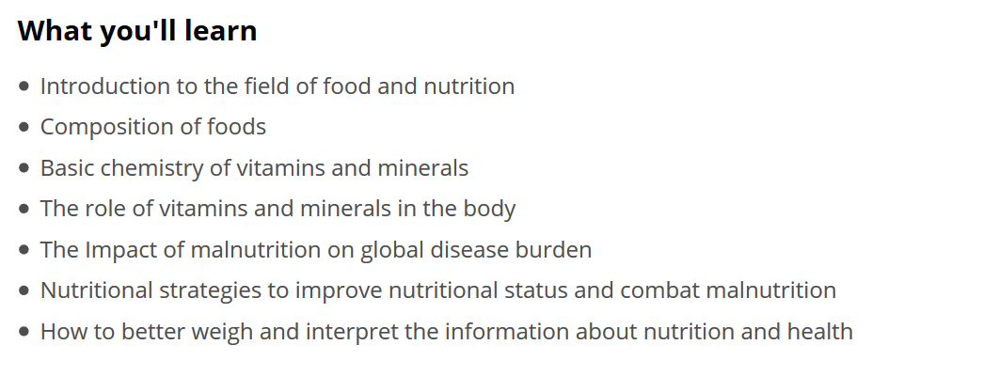

Schau dir als nächstes diese Lernziele [diesen Kurses](https://www.edx.org/course/nutrition-and-health-micronutrients-and-malnutrition-0) an:

Die Lernziele enthalten kein Verb, sondern beschreiben nur die Inhalte, die in dem Kurs angesprochen werden. Solche Lernziele findest du häufig in E-Learning Kursen. Dem Kurs fehlt hierdurch ein Fokus, wohin die Lernenden gebracht werden sollen. Es macht für die Konzeption eines Kurses einen riesigen Unterschied, ob ich die chemische Zusammensetzung von Vitaminen benennen oder aufzeichnen muss. Sowohl die Instruktion ändert sich damit als auch die Zeit, die mit diesen Lerninhalen verbracht werden muss. 