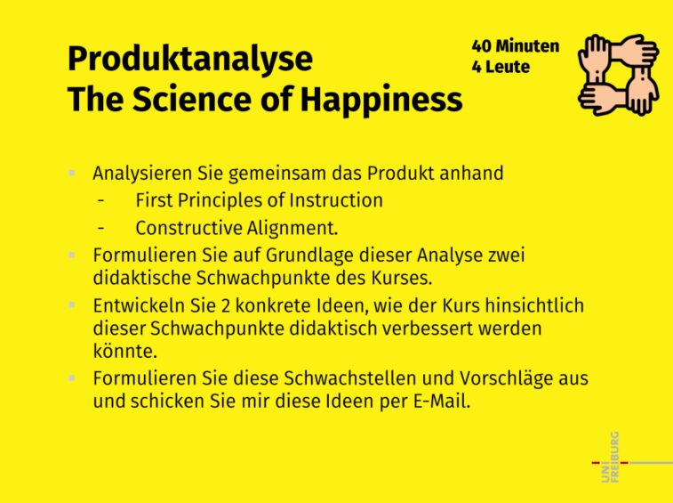

## Antwort 1

Grundlegend sind wir der Ansicht, dass sich dieser Kurs nicht für ein E-Learning Format eignet, da das Thema zu groß gefasst wurde, jedes Individuum seine eigenen Erfahrungen dazu macht und es keine einheitliche/objektive "Lösung" gibt- sprich es nicht problembasiert ist. Das Problem ist viel mehr: Wie wird man (also jedes Indiviuum) achtsamer? 

Didaktische Schwachpunkte: Es gibt keine direkten Lernziele für die Lektionen, sondern nur ganz am Anfang sehr grob Formulierte. Und zum Anderen stimmt das Verhältnis zwischen Instruktionen und Anwenden nicht. 
Die Lektionen wurden mit einem MC-Quiz abgeprüft, welche s.o. in keinem Verhältnis standen und nach dem Trail-and-Error-Verfahren gelöst werden konnten (obgleich es vorgeben war, wie viele Versuche man hatte). Das CA wurde somit verletzt. Auch die Priciples of Instuction wurden somit nicht ausgeglichen/ hinreichend eingesetzt. 
Man merkt, dass sich die Autor*innen daran orientieren wollten, jedoch vielmehr die Begriffe versucht haben einzubringen. Was jedoch zu einem erfolgreichen E-Learning führt, ist der korrekte Einsatz davon. Dazu sollte man die Begriffe ganzheitlich verstanden haben und genau wissen, was damit gemeint wird (z.B. was heißt "aktivieren"- ist es ein Anknüpfen der letzten Lektion? Oder ein Anknüpfen an allgemeines Vorwissen zu diesem Thema?!). 
Unsere Verbesserungsvorschläge sind erstens, dass wir die Lernziele vor jeder Einheit konkreter gestalten würden. Zweitens sollte die Balance zwischen Instruktion, Demonstration und Anwendung hergestellt werden. Drittens sollte die Abprüfung (MC Fragen o.ä.) angeglichen werden.

## Antwort 2

Eine Schwachstelle des E-Learnings ist die Lernzielformulierung. Eigentlich werden gar keine richtigen Lernziele angegeben, sondern nur die behandelten Themen in Form von Fragen aufgelistet. Besser wäre es, die Lernziele so zu formulieren, dass der Lernende erfährt, was er nach dem Kurs in der Lage ist zu tun. Dafür sollten in der Formulierung Verben verwendet werden, die beobachtbar, spezifisch und erreichbar sind. Außerdem besteht der Großteil des Kurses nur aus Instruktion in Form von sehr langen Videos. Diese sind nicht einheitlich gestaltet sondern zusammengewürfelt und bilden keine klare Linie. Besser wäre es, die Inhalte kurz und spielerisch darzustellen und vorallem das E-Learning einheitlich zu gestalten. Zudem sind die Videos sehr theoretisch und wenig praxisnah. Hier könnte man statt langen Vorträgen über die Praxis, an Beispielen die Umsetzung zeigen.

## Antwort 3

Die First Principles of Instruction sind nicht besonders gut umgesetzt. Nicht alle Prinzipien sind umgesetzt, der Schwerpunkt liegt hier stark auf der Instruktion, welche durch übermäßig viele Videos und Texte umgesetzt wird. Hierbei werden KursteilnehmerInnen kaum zu aktivem Lernen angeregt.
Der Kurs könnte durch bessere Visualisierungen verbessert werden. Zusätzlich wäre es im Sinne der First Principles of Instruction sinnvoll, dass zu Beginn erklärt wird, was auf die KursteilnehmerInnen zukommt und diese eine bessere Evaluation ihrer Ergebnisse erhalten.
Wir würden vorschlagen, dass zusätzlich zu den Gesamtlernzielen wöchentliche Lernziele hinzugefügt werden, da diese das Constructive Alignment stark verbessern würden. Es wäre hierdurch weit einfacher den wöchentlichen Kurs an die tatsächlichen Gesamtlernziele anzupassen.

## Antwort 4

Didaktische Schwachpunkte sind die Anwendung der Meditationsarten, die unserer Meinung nach zu spät kamen und es keine Demonstration gab. Ein weiterer Schwachpunkt ist, dass zu Beginn der Einheit die Methodenvielfalt zu gering war.  Die Lernziele wurden hinsichtlich des Constructive Alignment zu allgemein formuliert und die Beantwortung der Fragen war eine Reproduktion des Gelesenen und keine Verständnisabfrage. Eine mögliche Idee ist ein veränderter Ablauf der Methodenwahl im Modul. Beispielsweise Beginn mit Demonstration oder Anwendung. Bezüglich des Constructive Alignment gäbe es eine Vielzahl an Möglichkeiten wie man die Einheit didaktisch verbessern könnte. Zum einen könnte man Lernziele als Kompetenzen aufschreiben, die der Lernende erwerben soll und zum andern diese auch aktiv und spezifisch formulieren.  

## Antwort 5

Es ist sehr schwierig, die Lernziele überhaupt zu entdecken. Sie sollten unserer Meinung nach präsent dargestellt werden und leicht auffindbar. Die Lernziele passen nicht besonders gut zu den Lernmethoden, da die Multiple-Choice Aufgaben konnten direkt nachgeschlagen werden.

* Idee 1: Besser offene Frageformate als nur Multipe-Choice,
* Idee 2: Ist E-Learning das passende Format für diese Lernziele? Präsenztermine mit gemeinsamen Durchführen von gemeinsamer Meidtaion/Yoga etc. Statt viele theoretische Texte zu lesen, sollten die Lernenden dazu motivieret werden, offline Kurse anzubieten und ein Lerntagebuch zu erstellen, welches dann durch die Kursleitung oder anderen Teilnehmern gefeedbackt.

Mit diesen Maßnahmen könnte die Schwachstelle des Problemlösen, Anwendens und Integrierens gelöst werden.

## Antwort 6

Schwachstellen:

* Es gab viel zu wenig Anwendungen, Demonstrationen und Aktivierungen.
* Es war zu lang und dafür wurden zu wenig Inhalte vermittelt.
* Das Constructive Alignment wurde nicht wirklich umgesetzt, da die Lernziele, Unterrichtsmethoden und Leistungsnachweise oder nicht sinnvoll angegeben bzw. eingesetzt wurden.  

Verbesserungsvorschläge:

* Es wäre besser für die Motivation und das Verständnis, weniger Fließtext zu verwenden und mehr Anwendungen, Demonstrationen und Aktivierungsaufgaben zu nutzen.
* Lernziele sollten konkreter formuliert werden, Unterrichtsmethoden sollten sinnvoll eingesetzt werden und es sollte einen auf die Lernziele und Unterrichtsmethoden abgestimmter Leistungsnachweis geben.
