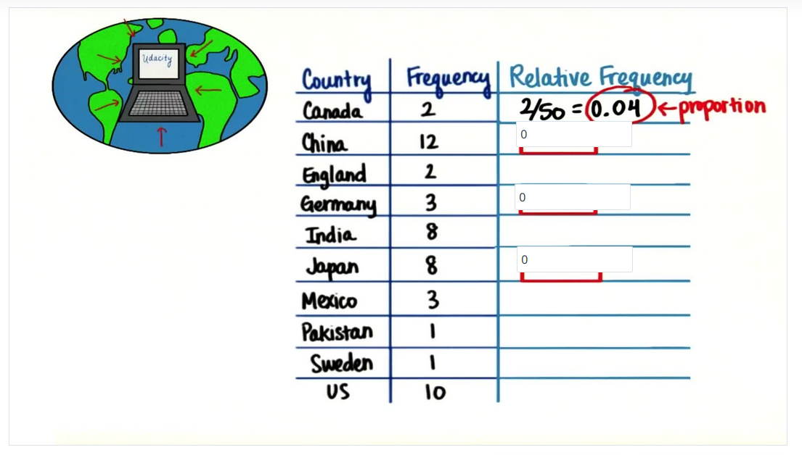

Die folgende Frage stammt aus einem Statistikkurs. In der Frage sollen die Lernenden die Proportion der einzelnen Ereignisse berechnen. Am Beispiel des Landes Kanada müssen die Lernenden die Häufigkeit (hier 2) durch die Anzahl aller Ereignisse berechnen (hier 50). Daraus ergibt sich eine Proportion von 0.04 oder 4%. 

Die Frage regt aktives Lernen aus mehreren Gründen an:

* Die Lernenden können die Frage nicht mit Hilfe von Trial- und Errorstrategien beantworten, sondern müssen eigenständig rechnen.
* Der Inhalt der Frage dient der Erreichung des Lernziels. Studierende müssen fähig sein, die relative Häufigkeit zu berechnen, um später Fragen beantworten zu können, die diese Fähigkeiten voraus setzen.
* Die Fähigkeit wird mehrere Male geübt, so dass die Lernenden angeregt werden, die Prozedur mehrmals anzuwenden. 
