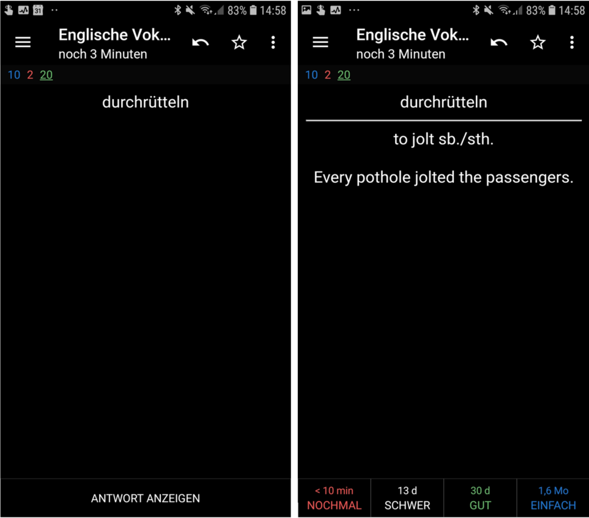

[Anki](https://ankiweb.net/about) ist eine effektive App, um Lerninhalte auswendig zu lernen, sie eignet sich allerdings nur bedingt für bedeutsames Lernen. Anki funktioniert wie jedes andere Karteikartensystem. Du erhälst eine explizit oder implizit gestellte Frage und musst die Antwort zu dieser Frage finden. Sehr beliebt sind solche Systeme im Medizinstudium, in dem man häufig eine Vielzahl an Begriffen auswendig lernen muss. Hier siehst du, wie es funktioniert. 

<iframe width="695" height="391" src="https://www.youtube.com/embed/F2K1gOSdIZA" frameborder="0" allow="accelerometer; autoplay; encrypted-media; gyroscope; picture-in-picture" allowfullscreen></iframe>

Bedeutsames Lernen wird durch diese Karteikarten aus folgenden Gründen nicht erzeugt:

* Lernende werden nicht dazu angeleitet, die Inhalte der Karten mit ihrem eigenen Vorwissen zu verbinden.
* Jede Karte verlangt stetig die gleiche Antwort. Es gibt keine Variation innerhalb der Fragen, so dass immer die gleiche Antwort verlangt wird.
* Die Lernenden werden nicht darin unterstützt, das Gelernte auf andere Domainen oder auf andere Probleme zu transferieren.

## Ein Beispiel

Ein konkretes Beispiel wäre folgendes: 

Du siehst das Wort *durchrütteln* und musst das englische Wort hierfür erraten (to jolt). Zusätzlich siehst du nachdem du Frage beantwortet hast einen Beispielsatz für die Frage. Um es vorab zu schicken. Auswendiglernen ist nicht per se schlecht, wir sollten nur versuchen in E-Learning Produkten, bedeutsames Lernen anzustreben. Warum? Weil wir dadurch besser sicherstellen können, dass der Lernende die Konzepte und Prinzipien nachhaltig lernen und dadurch auch in ihrem Alltag anwenden können. Die Frage wäre bei diesem Beispiel daher, wie wir sicher stellen könnten, dass Lernende dieses Wort besser behalten können? 

### Aktives Lernen fördern

Als erstes müssten wir sicher stellen, dass die Lernenden *aktiv* lernen. Das ist als E-Learning Entwickler nicht ganz in unserer Macht, da Lernende darüber entscheiden, wie kognitiv fokussiert sie sich auf den Inhalt konzentrieren. Wir könnten aber folgendes versuchen:

* Wir müssen sicher stellen, dass das Wort *durchrütteln* notwendig ist, um das zentrale Ziel des Kurses zu erreichen.
* Wir müssen Anreize schaffen, dass die Lernenden kognitiven Aufwand betreiben, die Übersetzung zu erraten. Das könnten wir beispielsweise erreichen, indem wir das System so aufbauen, dass falsche Antworten häufig wieder abgefragt werden. Hierdurch maximieren wir die Zeit, die Nutzer mit der Übersetzung diesen Wortes benötigen. 

Mit diesen Methoden haben wir allerdings noch nicht bedeutsames Lernen gefördert. 

### Bedeutsames Lernen fördern

An der Stelle bist du dran. Überlege dir einmal, wie bedeutsames Lernen bei dieser App hergestellt werden kann. 

<iframe src="https://docs.google.com/forms/d/e/1FAIpQLScay8sV4L9SGmsAzaa8Vqup-MU9Jshvn2NPrKDgCDqfUHHWhw/viewform?embedded=true" width="640" height="545" frameborder="0" marginheight="0" marginwidth="0">Loading...</iframe>