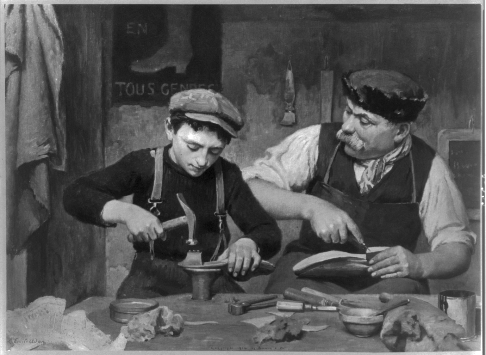

Hier siehst du ein paar Lehrstile, wie sie häufig anzutreffen sind:

## Die Vorlesung

Wenn du in einer Vorlesung sitzt, bist du meistens passiver Empfänger des Lernstoffs. Deine Aufgabe besteht darin, dir den Inhalt zu notieren und zu Hause eigenständig anzueignen.

## Das Klassenzimmer

So stellen sich die meisten Menschen Lehre vor. Eine Lehrkraft arbeitet mit 10 bis 30 Schüler\*innen. Ein Teil der Zeit gibt die Lehrkraft Instruktionen, an einem anderen Teil gibt die Lehrkraft den Lernenden Übungen. 

## Die Meisterlehre

Der älteste Lehrstil ist die klassische Meisterlehre. Ein Meister steht mit dir in einem engen Verhältnis und hat die Aufgabe, dich in Fähigkeiten eines Faches einzuführen. Er gibt dir anfangs einfachere Aufgaben und unterstützt dich dabei, wenn du Schwierigkeiten hast. 