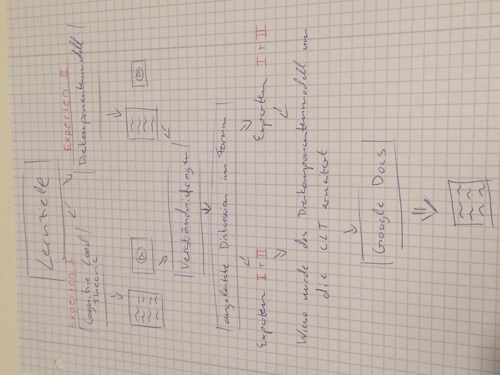
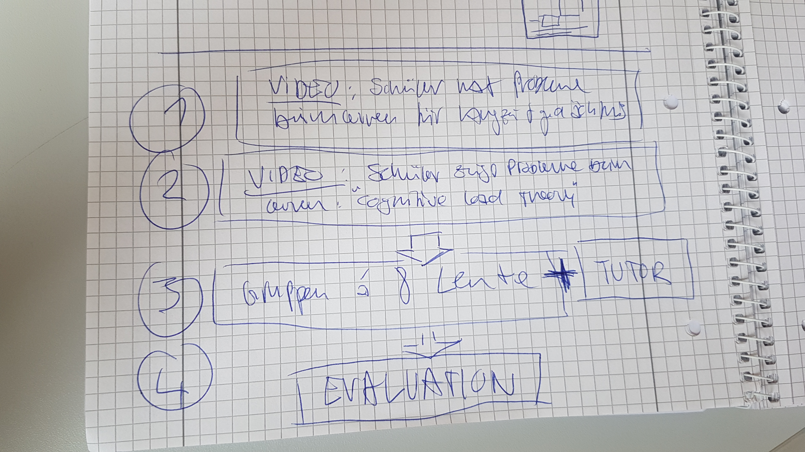
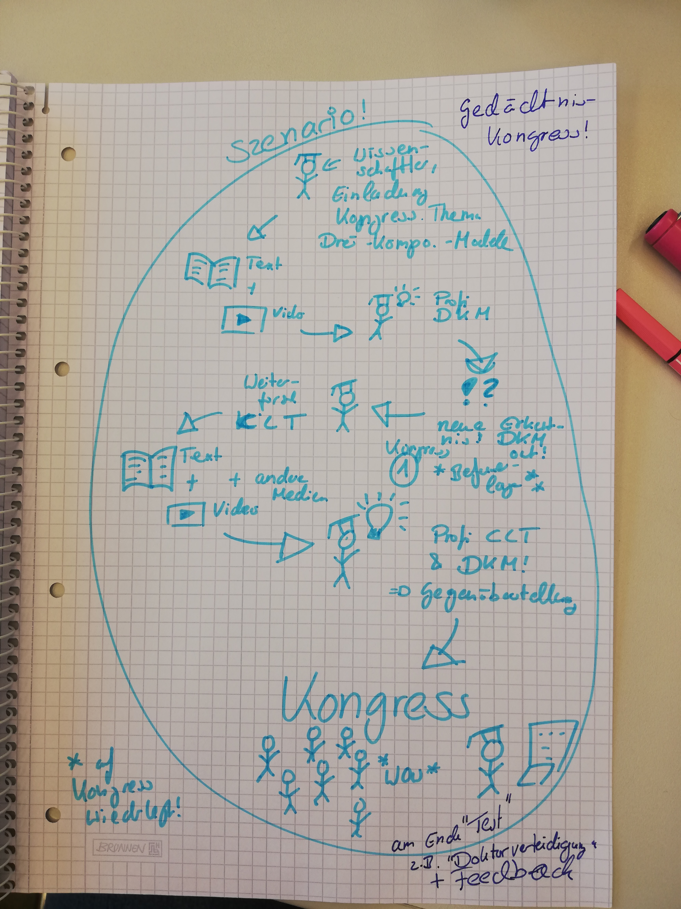
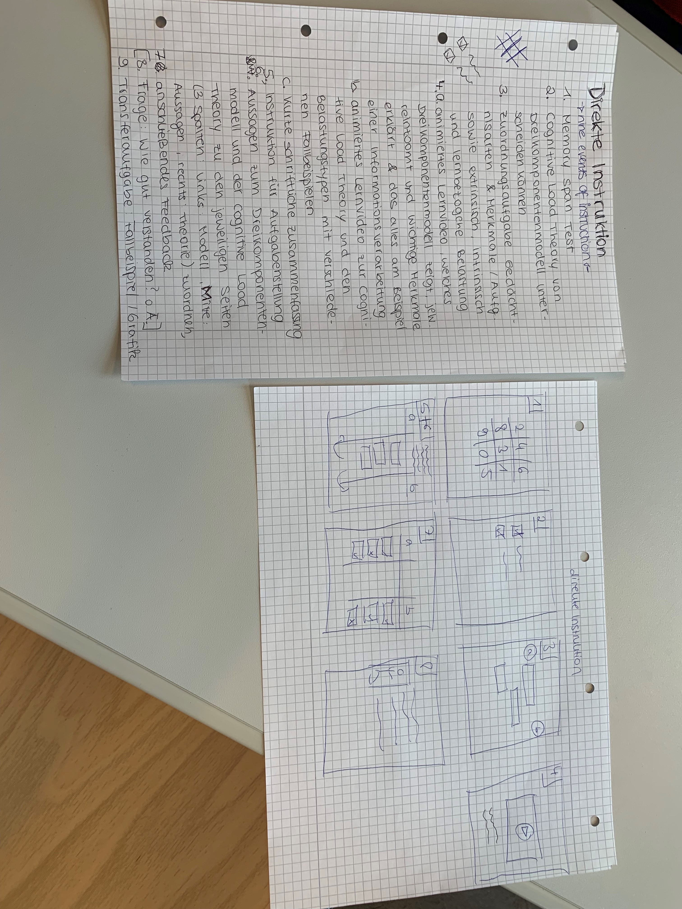

## Problem Based Learning 1

Zunächst entstehen nach einem Zufallsprinzip zwei Expertengruppen, die das jeweilige Topic „CLT“ oder „Dreikomponentenmodell“ anhand von bereitgestellten Materialien (Video; Text ect.) bearbeiten.  Austauschmöglichkeiten innerhalb den jeweiligen Expertengruppe gibt es durch einen Chat, bzw. ein Forum.

Im Anschluss wird das Wissen durch prägnante Verständnisfragen, die jeder Teilnehmer zunächst für sich prüfen soll, verfestigt; mind. eine Antwort zu den Verständnisfragend muss im Forum gepostet werden, um weiter arbeiten zu können. 

Dann waren Experten aus Gruppe I & II zu glichen Teilen gemisch. Es entstehen wiederum zwei Gruppen, die jeweils die Frage: "Wieso wurde das Dreikomponentenmodell um die CLT erweitert & inwiefern wird das für sinnvoll erachtet?“  

Diese Gruppen werden jeweils für sich wird in einen Videochat geladen; den Zeitpunkt, wann das/ die Chats stattfinden müssen die Teilnehmer selber koordinieren. 

Das „Produkt“ der Arbeit ist ein gemeinsames Dokument; das der jeweils anderen Gruppe bereitgestellt wird. Das Produkt kann im Anschluss wiederum im Forum diskutiert werden; bzw. geben die Teilnehmer ihren Gruppenmitgliedern ein anonymes Feedback zu unterschiedlichen Aspekten ihrer Arbeitsweiße (Kooperation, Kommunikationsbereitschaft, Fachwissen, Zuverlässigkeit ect.) 

## Problem Based Learning 2

1) das erste Video zeigt einen Schüler der lernt und Probleme hat Inhalte ins langzeitgedächtnis zu bringen. -》 DKM wird offensichtlich

2) Ein Lernender hat offensichtlich Probleme die auf die coginitive load theory zurückzuführen sind. -》 Lernt mit PowerPoint Präsentation, zu viele chunks. Oder Inhalte zu weit auseinander

-> Problem: Voneinander abgrenzen woran der Schüler scheitert 

3)gruppeneinteilung und Zuweisung eines Tutoren. -> Gruppen setzen sich Lernziele und Aufgabenverteilung zur Recherche

4) Evaluation über Chatforum mit anderen Gruppen und Tutor und Erreichung der Lernziele wird abgeprüft

## Goal Based Scenarios 1

## Direkte Instruktion 1

## Projektbasiertes Lernen 1

