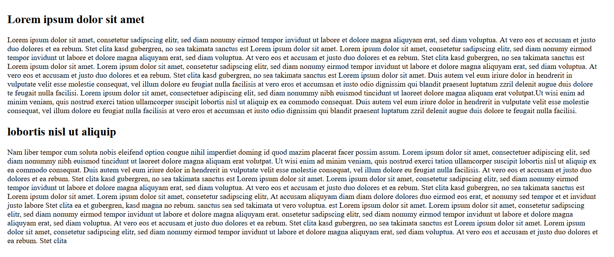
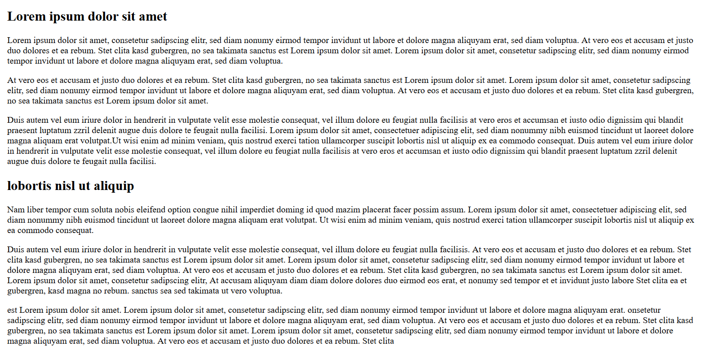
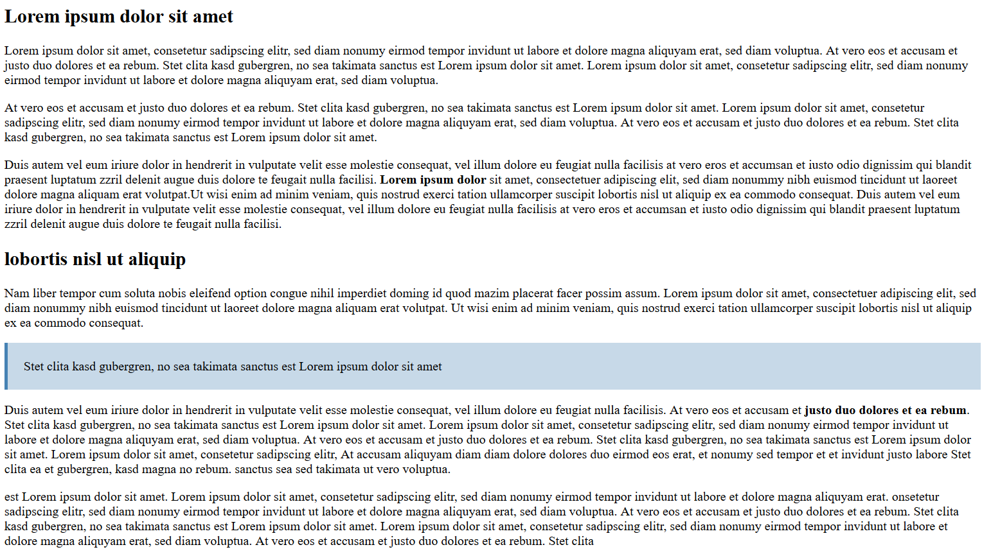

Es gibt allerdings auch legitime Gründe, Texte im Web darzustellen. Beispielsweise sind Texte sinnvoll, wenn Nutzer kein Audio abspielen können bzw. hörgeschädigt sind. Bei manchen Texten ist zudem der Wortlaut entscheidend. Stell dir nur einmal Gesetzestexte vor, die Nutzer verstehen sollen. Aber auch E-Learnings zum Thema Programmierung werden häufig in der Form von Texten angeboten, da bei diesen Produkten der exakte Wortlaut entscheidend ist. Und: Beim Lesern werden zudem mehr Wörter verarbeitet als beim Sprechen, so dass mehr Informationen in kürzerer Zeit verarbeitet werden können. 

Wenn wir Texte in E-Learning Produkten verwenden, sollten wir daher den Nutzern ermöglichen, die Inhalte der Texte zu scannen. Wenige Nutzer schauen sich alle Inhalte eines E-Learning Produktes an, vielmehr möchten sie die relevanten Inhalte so schnell wie möglich abgreifen.

Schau dir zunächst einmal folgenden Text an:

## Überschriften verwenden

Durch Überschriften kann ein Nutzer schneller erkennen, wofür welcher Abschnitt steht:

## Paragrafen einfügen

Durch Paragrafen kann ein Nutzer die Sinnabschnitte innheralb der einzelnen Abschnitte schneller erkennen.

## Hervorhebungen einfügen

Durch weitere Hervorhebungen kann man dem Nutzer die zentralen Botschaften des Textes angeben. 

