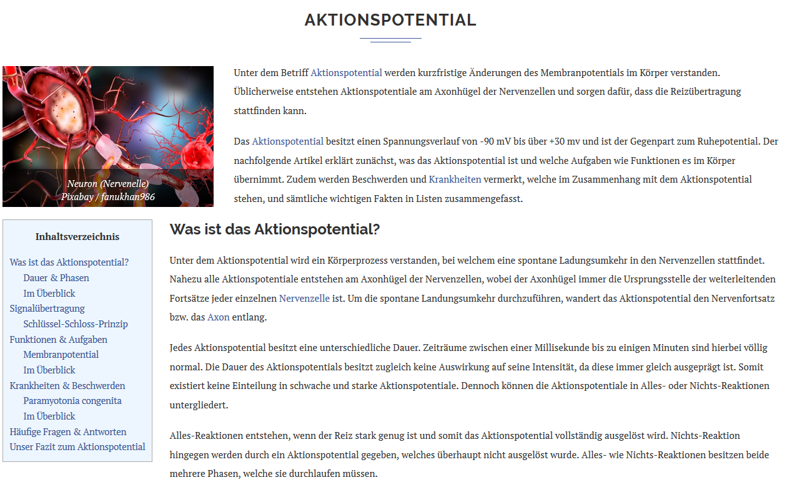

Video: Wir können aus der Forschung manche gute Tipps erhalten. Nutzer schauen sich Bilder häufig nicht an und dynamische Bilder sind schwieriger zu verarbeiten als dynamische. Zusätzlich können wir ein Modell aufstellen, wie Nutzer Texte und Bilder verarbeiten und daraus erklären, wie gut Lernende aus einem Beispiel lernen können. Du als INstructional Designer solltest folgende Dinge beachten: 

## Text und Bild sollten sich inhaltlich überschneiden

Mit Bildern suggerierst du, dass es einen Verbindung zwischen dem Bild und dem Text gibt. Existiert diese Verbindung nicht, verleitest du die Nutzer dazu, nach Verbindungen zu suchen, die nicht existieren. Du brichst damit ihren Gedankengang ab. Achte daher darauf, dass es immer eine gewissen inhaltliche Überschneidung zwischen Text und Bild gibt.

##  Füge Bilder ein, die Informationen enthalten, die relevant für das Konzept sind, dass du gerade erklärst

Illustrationen sind nett. Sie bringen aber nicht viel für das Lernen. Versuche daher, auf interessante aber irrelevante Illustrationen zu verzichten (z.B. [hier](https://krank.de/koerperprozesse/aktionspotential/)):

## Einfache Visualisierungen sind in der Regel besser als komplexe Visualisierungen

Das Arbeitsgedächtnis des Menschen ist beschränkt. Dem müssen wir Rechnung tragen, vor allem, wenn Nutzer nocht wenig Wissen über ein Thema haben. Dynamische Visualisierungen sind zu flüchtig und zu komplex, wenn sie auch noch mit den Inhalten von Texten verbunden werden sollten. Meistens ist eine statische Visualisierung genausogut oder sogar besser. Keep it simple!

## Es gibt Alternativen für Texte und Bilder

Texte können ebenso gesprochen werden, hierdurch müssen Nutzer Ihre visuelle Aufmerksamkeit nicht zwischen Texte und Bildern teilen. Viele Theorien in der Lehr- und Lernforschung gehen davon aus, dass zwar unser Arbeitsgedächtnis begrenzt ist, wir aber zwei Kanäle haben, die getrennt voneinander arbeiten. Der eine Kanal verarbeitet visuelle Informationen, der andere auditive Visualisierungen. Ist der auditive Kanal voll belastet, können wir immer noch Informationen auf den visuellen Kanal legen. Dieses Prinzip machen sich instruktionale Videos zu nutze. Wenn Visualisierungen sehr komplex sind, ist es eine gute Idee, den Text zu sprechen, anstatt ihn als Text zu präsentieren. 

