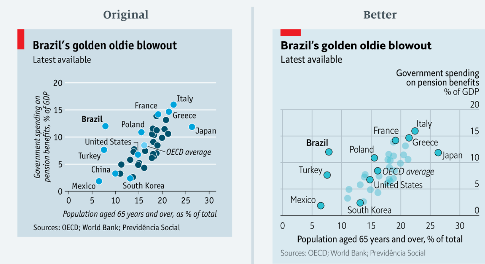

Visualisierungen können unterschiedlich komplex sein. Balkendiagramme sind einfacher zu verarbeiten als Netzwerkmodelle. Frei nach dem Designprinzipien von [Dieter Ram](https://www.vitsoe.com/de/ueber-vitsoe/gutes-design) sollten Visualisierungen so wenig wie möglich darstellen, aber genug, um die Hauptidee der Grafik zu verstehen. Schau dir Beispielsweise diese Grafikverbesserung des [Economist](https://medium.economist.com/mistakes-weve-drawn-a-few-8cdd8a42d368) an:

Hiher wurde die Komplexität reduziert, indem die unwesentlichen Elemente farblich transparent visualisiert wurden. Der Staat Brasilien als zentraler Punkt der Visualisierung ist hierdurch stärker hervorgehboen. 

Ganz ähnlich können bestimme Inhalte von Grafiken hervorgehoben werden, indem man Informationen irrelevanter Punkte abschwächt oder entfernt. Hier wurden Bewertungen von Serien visualisiert. Der grüne Strich kennzeichnet den linearen Trend über die Jahre. Die grauen Punkte sind bewusst abgeschwächt, um den Trendverlauf der einzelnen Serien hervorzuheben. 

