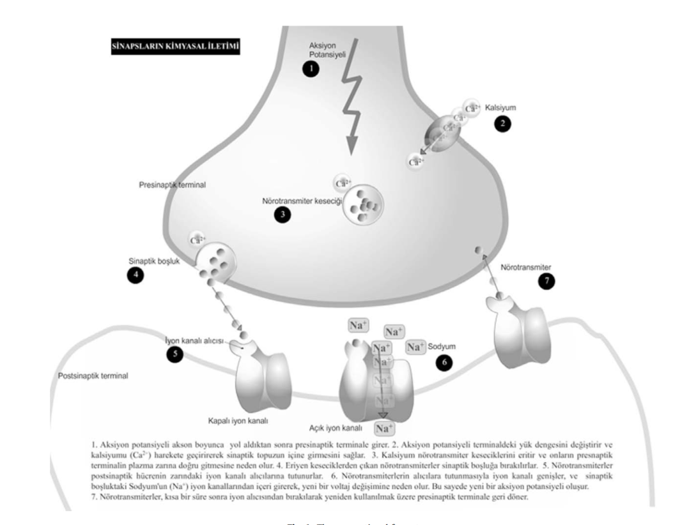
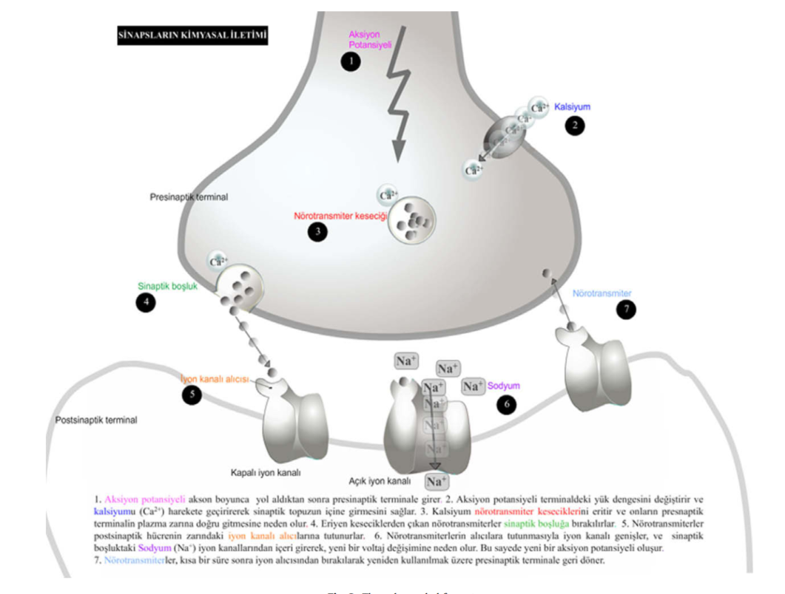

Lernende finden häufig nicht die Korrespondenz zwischen einem Text und einem Bild. Um dies zu vereinfachen, nutzen Signalisierungen. Schau dir einmal folgende beiden Grafiken an:

In diesem Bild sehen Nutzer ein Neuron und einen Text, der erklärt, wie dieses Neuron funktioniert. Nutzer müssen die wesentlichen Begriffe des Textes mit der Grafik verbinden. 

In diesem Bild sind diese Begriffe farblich hervorgehoben, so dass Nutzer die Korrespondenz zwischen Text und Bild schneller erkennen. 

Forschung zeigt, dass Signaling einen positiven Effekt auf das Lernen aus Texten und Bildern hat (siehe [Schneider, Beege, Nebel, & Rey, 2018)](https://www.sciencedirect.com/science/article/pii/S1747938X17300581). Du solltest daher häufig auf Signaling zurück greifen, um die Korrespondenz zwischen einem Text und einem Bild hervorzuheben. 