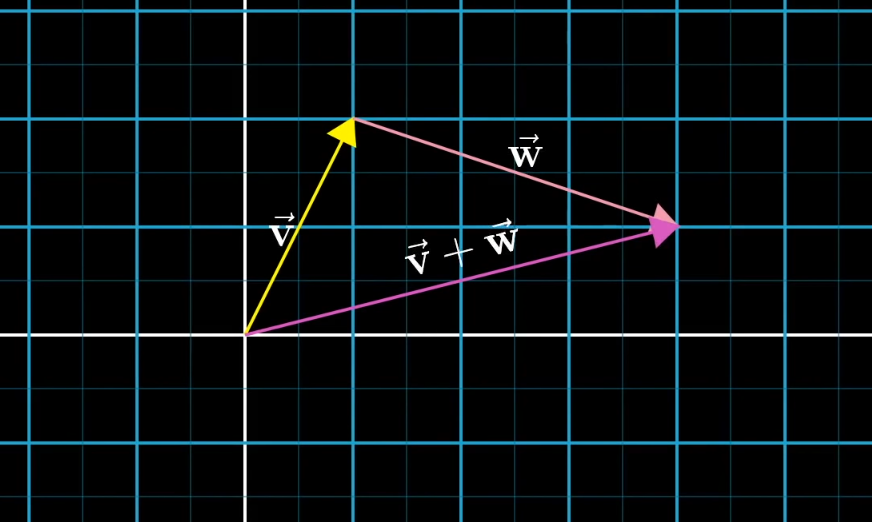

## Literatur lesen

* Lesen Sie [Mayer & Moreno (2003)](https://ilias.uni-freiburg.de/goto.php?target=file_1282269_download&client_id=unifreiburg)

## Video analysieren

Schaut dir [dieses Video von 3Blue1Brown](https://www.youtube.com/watch?v=fNk_zzaMoSs&list=PLZHQObOWTQDPD3MizzM2xVFitgF8hE_ab) an. Schreibe ein kurzes Essay, bei dem du auf folgende Leitfragen eingehst:

* Welche Multimedia Prinzipien wurden in dem Video umgesetzt? 
* Welche Multimedia Prinzipien wurden in dem Video *nicht* umgesetzt? 
* Beschreibe die Selektions-, Organisations- und Integrationsprozesse die in dem Ausschnitt des Videos zwischen 00:04:48 bis 00:05:09 auftreten. Versuche diese Prozesse **kognitiv** zu beschreiben.

