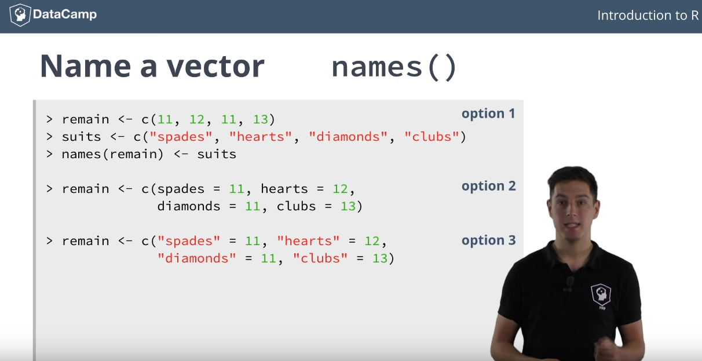
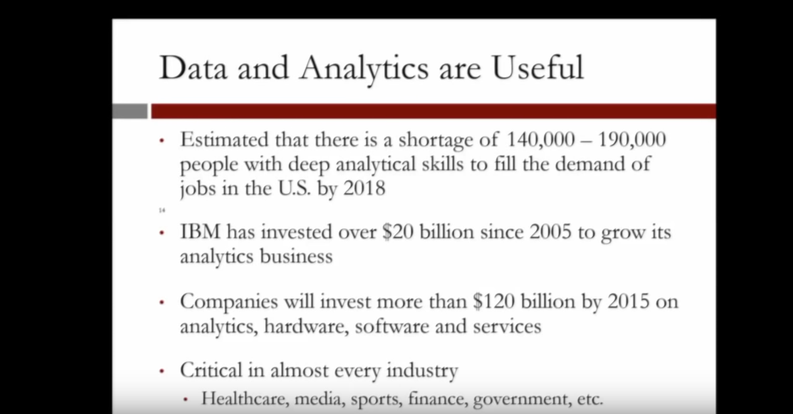
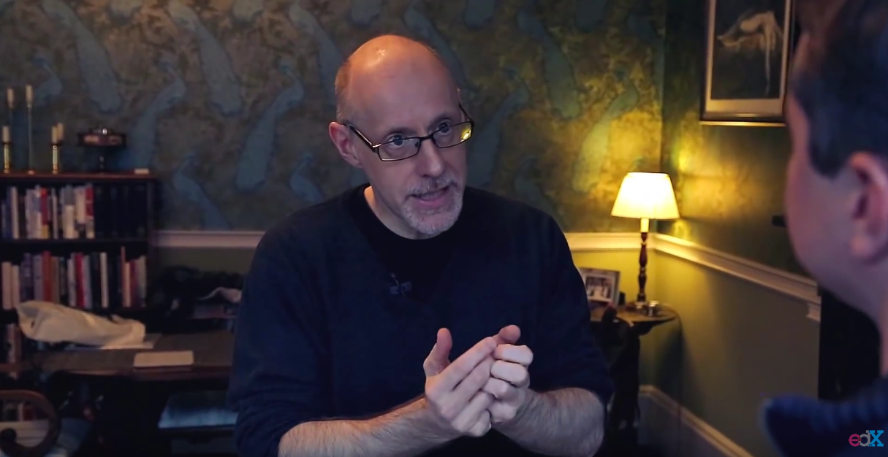
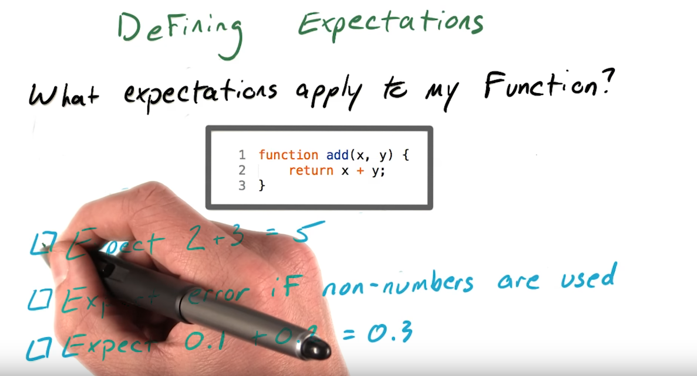
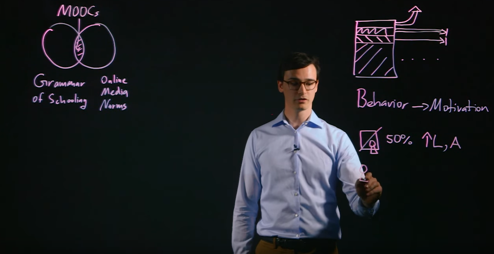

Videos gibt es in ganz verschiedenen Formaten. Hier siehst du eine Auflistung der gängigsten. 

## Talking Head

https://www.youtube.com/watch?v=w5dOALbZ9HE&list=PLjgj6kdf_snYBkIsWQYcYtUZiDpam7ygg&index=3

## PowerPoint Aufnahme

https://www.youtube.com/watch?v=-mW-DYFyGqg

## Lecture Format

https://www.youtube.com/watch?v=ZK3O402wf1c

## Interview

https://www.youtube.com/watch?v=On10j3W-yGA

## KhanStyle Videos

https://www.youtube.com/watch?v=c2yjCKfqstA&list=PLAwxTw4SYaPkv4LG-0UHNfhPkKPfYacOg&index=8

## Transpartent Screen

https://www.youtube.com/watch?v=5YzdS1k5LZM