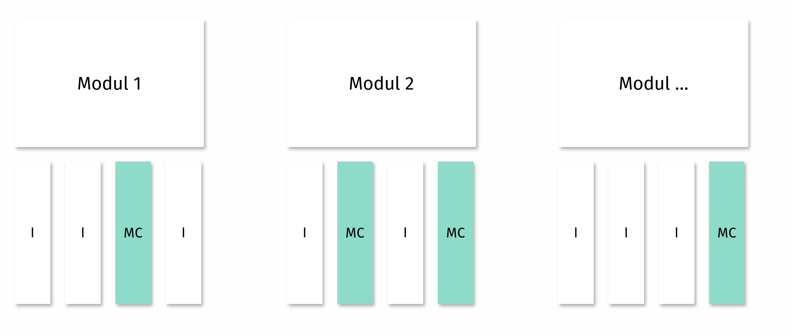
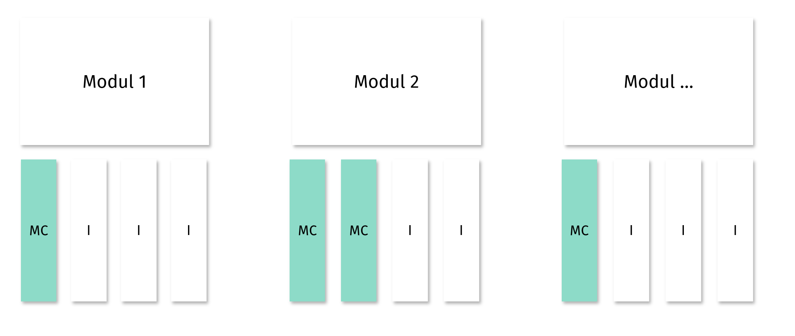

Viele E-Learning Produkte sind eine abgeschwächte Form der direkten Instruktion. Instruktion wird in Form von Videos und Texten angeboten, begleited von vereinzelten Multiple-Choice Aufgaben. Multiple-Choice Aufgaben sind mittlerweile so gängig, dass wir fast gar nicht mehr darüber nachdenken, warum wir diese Testaufgaben verwenden. Ein typischer Aufbau sieht häufig so aus:

Kurse sind in Module aufgeteilt und Lernende erhalten instruktionale Erklärungen (hier I) und periodisch Multiple-Choice Aufgaben (hier MC). Multiple-Choice Aufgaben haben die Funktion, das gerade gelernte Wissen zu festigen. Sie dienen nach den First Principles of Instruction daher der Anwendung des Wissens.

Wir könnten uns allerdings auch einen ganz anderen Aufbau vorstellen: 

Hier erhalten Lernende zuerst Multiple-Choice-Fragen und anschließend die Instruktion. Wir könnten dieses Konzept auch als **Productive Failure** bezeichnen. 

Entscheident ist, dass dieser Aufbau nicht so sein muss. Als Instructional Designer solltet ihr dahin kommen, den Aufbau eines Kurses didaktisch zu konzipieren. Beispielsweise führt der klassische Aufbau häufig zu einer Illusion des Verständnisses. Dadurch, dass das Wissen kaum getestet wird, glauben Lernende etwas zu wissen, selbst wenn ihre eigentliche Leistung deutlich geringer ist. Als Folge verarbeiten Lernende Lerninhalte, die für sie noch zentral wären, weniger intensiv und wählen zu komplexes Lernmaterial aus. Durch die Verwendung von Testaufgaben können wir dem Vorbeugen. Dies können wir durch gute Testaufgaben vermeiden.
