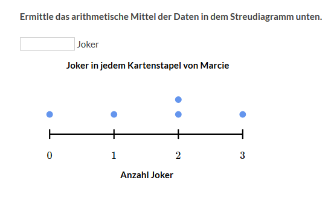
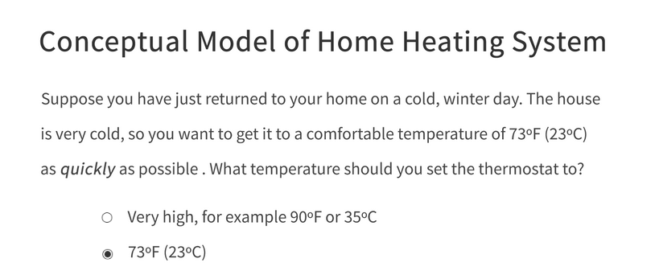
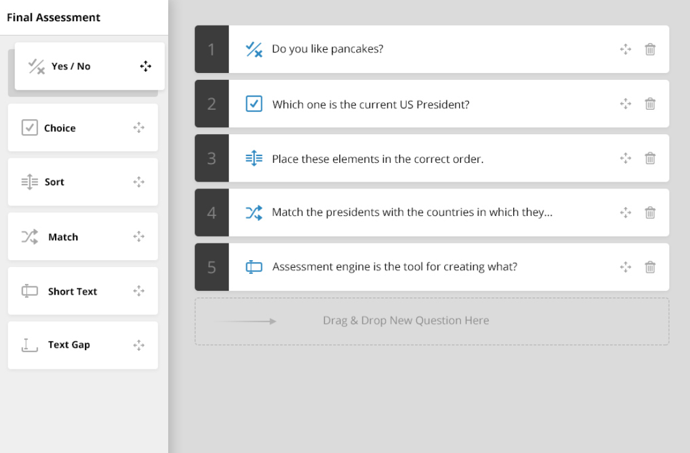

Es gibt ganz verschiedene Testaufgaben. Hier mal nur eine paar aufgelistet: 

## Short-Answer

https://de.khanacademy.org/math/statistics-probability/summarizing-quantitative-data

## Multiple Choice

https://classroom.udacity.com/courses/design101/lessons/300162902/concepts/4385288580923

## Fill-in-the-Blank

## Drag-Drop

