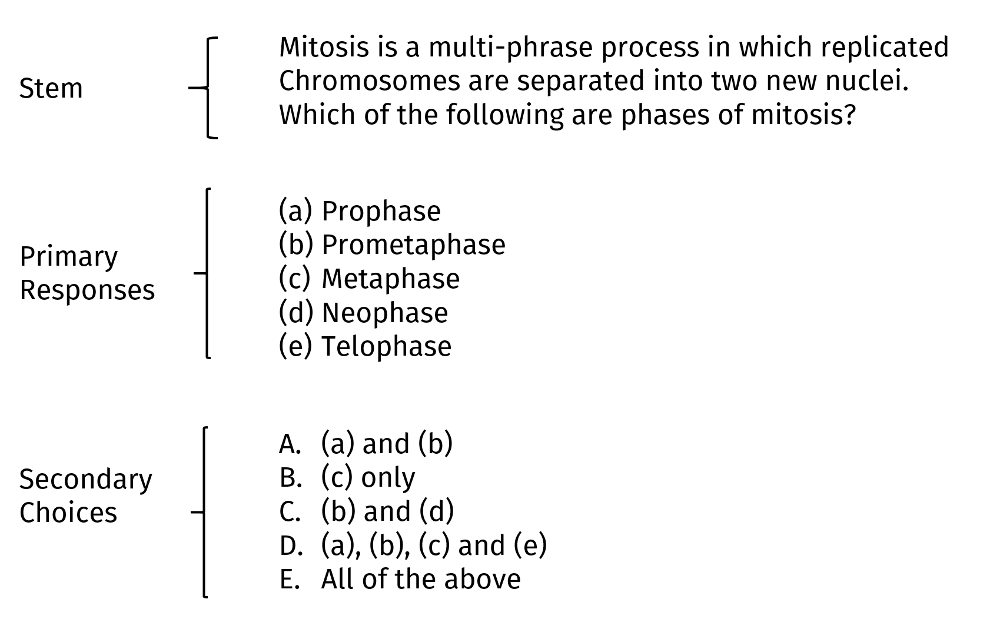

Multiple-Choice Fragen haben immer den gleichen Aufbau:

Es gibt einen Stamm, primäre Antworten und sekundäre Antworten. Die Frage ist nun, wie wir den Stamm und diese beiden Antwortfelder gestalten sollten:

## Verwende keine komplexen Items und Antwortmöglichkeiten

Häufig findet man Items wie: (a), (b) und (c), oder (a) und (b). Die Idee ist, je komplexer diese Items sind, desto tiefer wird über den Lernstoff nachgedacht. Das stimmt allerdings nicht. Solche Items verleiten Lernende eher dazu, falsche Antworten zu suchen und Hinweise zu finden, die die falsche Antwort preisgeben. Zudem sind einfache Antwortformate meistens genausogut Lernen zu messen und Lernen zu unterstützen. Zuletzt sind solche Antwortmöglichkeiten schwierig zu schreiben und komplex. 

## Schreibe Items, die spezifische kognitive Prozesse anregen

Überlege dir bei der Erstellung der Aufgaben, welche kognitiven Prozesse angeregt werden sollen. Sollen Lernende *unterscheiden* lernen, *identifizieren* lernen, *definieren* lernen? Diese Prozesse sollten sich mit deinen Lernzielen decken. 

## Verwende nicht *Keine der Antworten (NOTA)* oder *Alle Antwortmöglichkeiten (AOTA)* als Item

Es wird zwar gerne gemacht, sollte aber vermieden werden. NOTA führt dazu, dass es die Unterscheidbarkeit der Items verschlechtert. AOTA kann ausgeschlossen werden, sobald man weiß, dass eine Antwort nicht stimmt. Besser ist es, gute Items zu schreiben, die typische Misskonzepte von Lernenden ansprechen. 

## Verwende drei mögliche Antwortmöglichkeiten

Die beste Balance zwischen psychometrischer Qualität und der größten Effizienz in der Beantwortung von Multiple-Choice Fragen liegt bei drei Antwortmöglichkeiten. Dies ist ein Richtwert, du kannst je nach der Anzahl der plausiblen falschen Antworten natürlich auch noch ein/zwei weitere Antworten dazu überlegen. Distraktoren sollten übliche Fehler und Misskonzepte von Lernenden ansprechen. Zudem besteht die Gefahr bei mehreren falschen Antworten, dass Lernende diese lernen könnten und hierdurch falsches Wissen aufgebaut wird (negative suggestion effect). 

## Verwende mehrere Multiple-Choice Tests, die herausfordernd, aber nicht zu schwierig sind

Der Abruf von Wissen ist bereits eine Lerntätigkeit. Wir sollten daher darauf achten, dass Lernende in der Lage sind, Multiple-Choice Fragen zu beantworten, sie sich aber anstrengen müssen, die Fragen zu beantworten. Wenn Aufgaben zu einfach sind, werden sie von Lernenden nicht aufmerksam verarbeitet und erfüllen ihren Zweck nicht. 