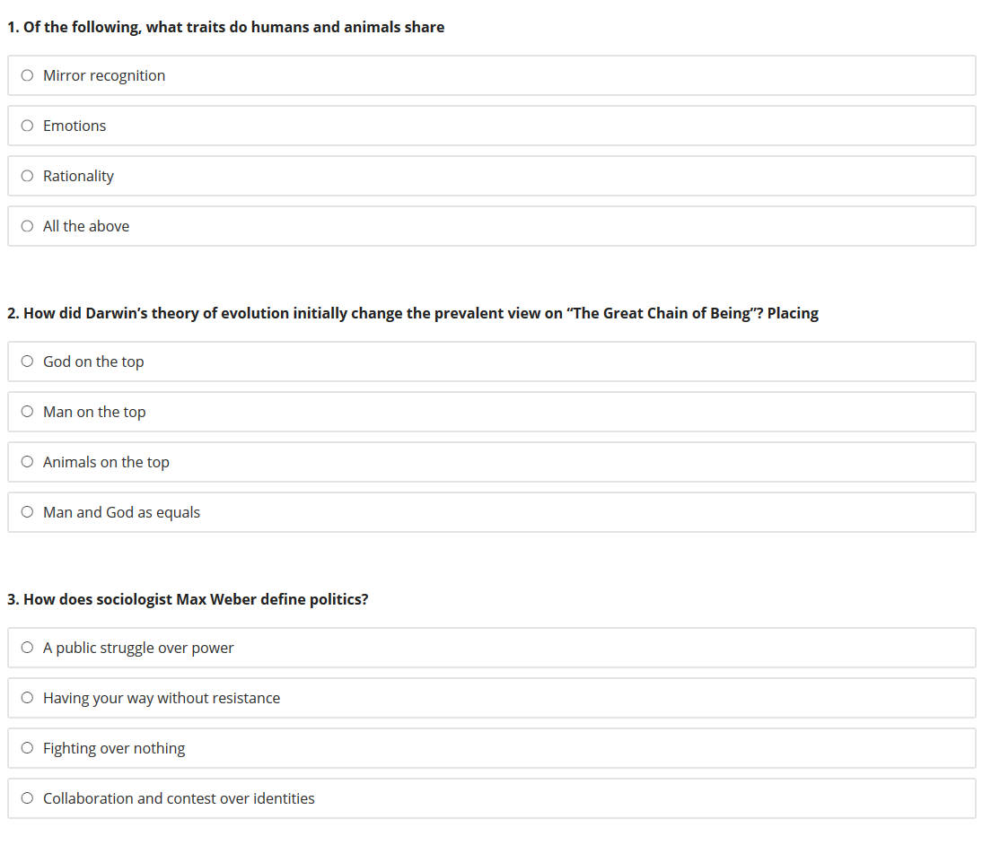
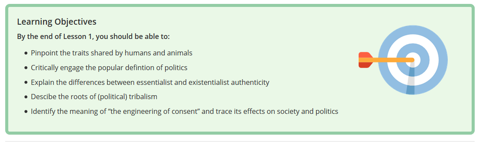

<iframe width="949" height="534" src="https://www.youtube.com/embed/STFSR95aEw0" frameborder="0" allow="accelerometer; autoplay; encrypted-media; gyroscope; picture-in-picture" allowfullscreen></iframe>

Bearbeitet Lesson 1 des Kurses [HOPE: Human Odyssey to Political  Existentialism von edX](https://www.edx.org/course/hope-human-odyssey-to-political-existentialism-2). Schreiben Sie anschließend ein Analyse des Produktes indem Sie auf folgende Leitfragen eingehen: 

* Inwieweit ist in diesem Kurs Constructive Alignment hergestellt? Schauen Sie sich hierzu die Lernziele der Lesson 1 an (siehe Bild unten)
* Inwieweit wurden in diesem Kurs die First Principles of Instruction umgesetzt? Bennenen Sie je 2 Bestandteile der First Principles of Instruction, die umgesetzt bzw. nicht umgesetzt wurden.
* Inwieweit wurden in diesem Kurs die Multimedia Principien nach Mayer umgesetzt und Soziale Präsenz hergestellt? Schauen Sie sich dazu das Video 1.1. Human/Nature - Watch:The Great Chain of Being und 1.2. Identity und Authenticity - Watch:Us and Them, Us vs. Them an.
* Inwieweit werden Best-Practices bei den Testaufgaben umgesetzt? Schauen Sie sich hierfür die Aufgaben des Quizzes 1.1 Human/Nature Quiz (siehe Bild unten)

Laden Sie Ihre Analyse auf [Ilias](https://ilias.uni-freiburg.de/goto.php?target=exc_1240096&client_id=unifreiburg) hoch.

