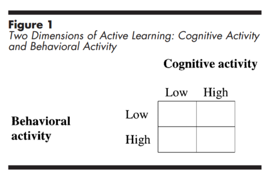

<iframe width="1922" height="945" src="https://www.youtube.com/embed/-hRzkFWGq58" frameborder="0" allow="accelerometer; autoplay; encrypted-media; gyroscope; picture-in-picture" allowfullscreen></iframe>

Aktives Lernen findet immer dann statt, wenn sich die Lernenden **geistig** mit dem Lernstoff beschäftigen. Aktives Lernen ist zudem ein Kontinuuum. Man lernt nicht entweder aktiv oder nicht aktiv. Vielmehr kann man aktiver und weniger aktiv lernen. 

Sich geistig mit einem Thema beschäftigen bedeutet nicht, dass man nicht auch körperlich aktiv ist. Körperliche Aktivität ist allerdings für das Prinzip keine notwendige Bedingung. [Mayer (2004, S. 15)](https://psycnet.apa.org/record/2004-10043-002) hat diese Idee einmal in folgender Grafik zusammen gefasst: 

Entscheident für erfolgreiches Lernen ist, dass wir **kognitiv aktiv** sind. Diese Idee klingt banal, sie ist aber historisch relativ neu. Mit dem Konstruktivismus (nicht Kognitivismus!) kam man zu der Ansicht, dass Lernen eben nicht nur das Übertragen von Informationen ist, sondern dass jeder Lernende den Lernstoff mit bereits bestehendem Vorwissen verbinden muss, um nachhaltig zu Lernen. Ganz ähnlich wie einem Puzzle müssen neue Teile (neuer Lernstoff) an bestehende Strukturen angedockt werden. Dieses Andocken muss allerdings *aktiv* geschehen, das Lernende selbst in der Verantwortung sind, neues Wissen mit bestehendem Wissen zu verbinden. Lehrkräfte können lediglich Anreize schaffen, dass diese Verbindungen funktionieren. 

> Aktives Lernen findet immer dann statt, wenn Lernende Anstrengung aufwenden, den Lernstoff in ihrem Arbeitsgedächtnis zu verarbeiten und mit ihrem Vorwissen zu verbinden.

